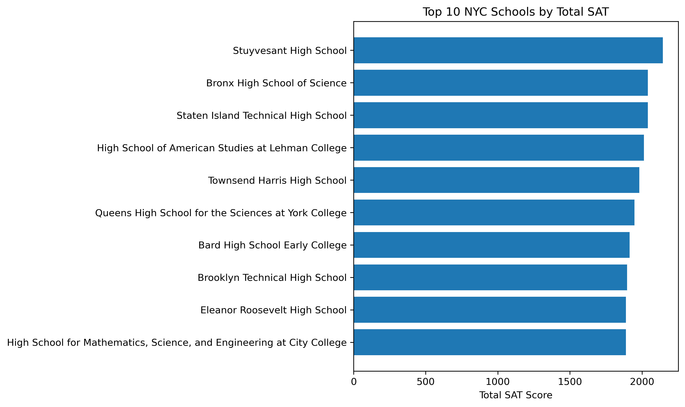

# 🏫 NYC Public School SAT Results — Data Analysis with Python

This project explores **New York City Public School SAT Results** to identify top-performing schools and borough-level performance variation using Python (pandas, matplotlib, numpy).

---

## 🎯 Project Objectives

1. **Identify top math-performing schools** — schools with an average math score ≥ 80% of the maximum (≥ 640/800).  
2. **Find the top 10 overall schools** — based on total SAT scores (Math + Reading + Writing).  
3. **Analyze borough-level variation** — find which borough has the largest SAT score standard deviation.

---

## 📊 Dataset
- **File:** `data/raw/schools.csv`  
- **Source:** NYC Open Data (public dataset)  
- **Columns used:**  
  - `school_name`  
  - `average_math`  
  - `average_reading`  
  - `average_writing`  
  - `borough`

---

## 📈 Key Insights

### 🧮 Best Math Schools (≥ 640 average)
| Rank | School Name | Avg Math |
|------|--------------|----------|
| 1 | Stuyvesant High School | 754 |
| 2 | Bronx High School of Science | 714 |
| 3 | Staten Island Technical High School | 711 |
| 4 | Queens HS for the Sciences at York College | 701 |

➡️ These schools consistently exceed 85% of the maximum possible SAT math score.

---

### 🏆 Top 10 Schools by Total SAT


`Stuyvesant High School` leads with a combined score of **2144**, followed closely by `Bronx High School of Science` and `Staten Island Technical High School`.

---

### 🗽 Borough Analysis
| Borough | # Schools | Avg SAT | Std Dev |
|----------|------------|----------|----------|
| Manhattan | 89 | 1340.13 | 230.29 |

➡️ **Manhattan** shows the **largest score variation**, suggesting a mix of both elite and lower-performing schools.

---

## ⚙️ Project Structure

nyc-schools-analysis/
├─ data/
│ ├─ raw/
│ │ └─ schools.csv
│ └─ processed/
├─ notebooks/
│ └─ nyc_schools_analysis.ipynb
├─ charts/
│ └─ top_10_schools.png
├─ src/
│ └─ utils.py
├─ environment.yml
├─ README.md
└─ report.html


---

## 🧠 Tools & Libraries
- Python 3.11  
- pandas  
- numpy  
- matplotlib  
- JupyterLab  

---

## 🚀 How to Run

```bash
conda env create -f environment.yml
conda activate nyc-schools
jupyter lab
